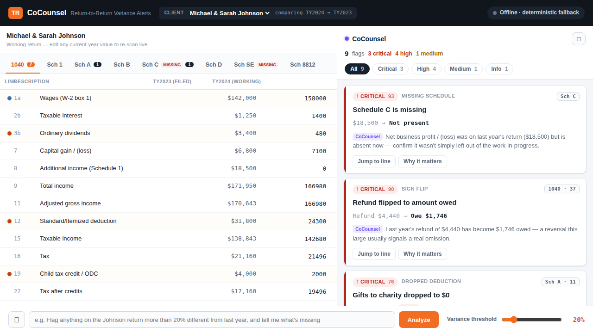

# CoCounsel · Automated Return-to-Return Variance Alerts

> **Hackathon Use Case 5.** Preparers miss anomalies when comparing current-year returns against prior-year data, so errors get caught late in review. **CoCounsel watches the working return against last year as the preparer types** and proactively surfaces anomalies — variances over a threshold, *missing schedules*, dropped deductions, sign flips, vanished income — each explained in plain English and **ranked by materiality** so the preparer isn't drowned in noise.



---

## Run it

> 📖 New here? **[docs/RUNNING.md](docs/RUNNING.md)** is the full run guide (with troubleshooting). If the tax terms (1040, schedules, refund…) are unfamiliar, **[docs/TAX-FOR-ENGINEERS.md](docs/TAX-FOR-ENGINEERS.md)** explains the whole domain for a software engineer.

```bash
./run.sh
# then open http://localhost:4200
```

Or manually, in two terminals:

```bash
cd backend  && npm install && npm start     # API on :3001
cd frontend && npm install && npm start      # UI on :4200
```

**No API key needed.** The app runs fully on deterministic fallbacks (regex NL parsing + tax-aware template explanations). To light up Claude-powered explanations and natural-language rule parsing:

```bash
export ANTHROPIC_API_KEY=sk-ant-…   # then run.sh
```

The top-bar pill flips from *“Offline · deterministic fallback”* to *“Claude live.”*

---

## The 3-minute demo (the Johnson return)

Michael & Sarah Johnson, married filing jointly, two kids. **TY2023 was filed and accepted; TY2024 is a work-in-progress** started from a prior-year proforma — exactly the situation where things silently fail to carry over.

1. **Setup.** The grid shows TY2023 (filed) beside TY2024 (working). The right panel is empty until you set a rule.
2. **Configure in plain English.** Type (or 🎤 speak) into the bar:
   > *“Flag anything on the Johnson return more than 20% different from last year, and tell me what’s missing.”*
   It parses to a structured rule (`threshold 20%`, focus *missing*, target *Johnson*) and shows a confirm chip.
3. **Analyze.** The panel ranks **9 findings by materiality**:

   | # | Flag | Why it matters |
   |---|------|----------------|
   | 1 | 🔴 **Schedule C is missing** | $18,500 business income gone *and* Schedule SE dropped → SE tax silently un-assessed. One card rolls up the whole cascade. |
   | 2 | 🔴 **Refund → Owe** | +$4,440 refund became −$1,746 owed (a $6,186 swing). |
   | 3 | 🔴 **Charity dropped to $0** | $7,500 → $0 — money left on the table. |
   | 4 | 🟠 **Child Tax Credit halved** | $4,000 → $2,000: 2 dependents but only 1 marked CTC-qualifying — an off-by-one. |
   | 5 | 🟠 **Estimated payments dropped** | $2,000 → $0 contributes to the balance due. |
   | 6 | 🟠 **Dividends −86%** | $3,400 → $480 — 3 of 4 1099-DIVs not yet entered. |
   | 7 | 🟠 **Itemized below standard** | $24,300 itemized < $29,200 standard → should switch methods. |
   | 8 | 🟡 **Withholding −20%** | under-withholding, part of why they owe. |
   | — | 🔵 **Wages +11% (Info)** | a benign raise, *below* the 20% threshold — shown quietly to prove the tool doesn’t cry wolf. |

4. **Live edit.** Drag the **threshold slider** to 30% → the withholding & wages flags drop off in real time. Or edit a current-year value (e.g. restore dividends to $3,400) → that card clears on the next scan.
5. **Voice.** Hit 🔊 in the panel — CoCounsel speaks the top issue aloud.
6. **Payoff.** Click the **Child Tax Credit** card → *“2 dependents but only 1 flowed to Schedule 8812 — $2,000 silently lost, and no total looks wrong.”* The kind of error a tired reviewer signs off on.

Switch the client dropdown to **Robert Smith** for a second scenario (a *new* Schedule C, a +200% dividend jump, and a refund→owe flip).

---

## How it works

```
┌────────────── Angular (signals) ──────────────┐      ┌─────────── Node + Express + TS ───────────┐
│ ReturnGrid (editable, prior vs current)        │ HTTP │ /scan       deterministic two-return walk  │
│ AlertsPanel · AlertCard · DeltaChip · Badge    │◄────►│ /returns    normalized pair + line registry│
│ NlConfigBar (NL + voice) · Threshold slider    │      │ /parse-rule Claude Sonnet  (+ regex)       │
│ VarianceStore (single source of truth)         │      │ /explain    Claude Opus    (+ templates)   │
└────────────────────────────────────────────────┘      │ /health     reports claude_available       │
                                                         └────────────────────────────────────────────┘
```

**The engine is the IP, and it’s pure & deterministic** (no LLM in the detection path):

- **13 detectors** — sign flip, missing/new schedule, missing line, vanished income, dropped deduction, dropped carryover/depreciation, %-variance, absolute-$ jump, ratio/consistency (incl. *itemized-below-standard* and *Schedule C without SE*), structural (filing status / CTC off-by-one), and a sub-threshold *informational* tier.
- **Materiality scoring** — a 0–100 severity blending %-change, log-squashed $-magnitude, and a per-type risk weight, with floors so sign-flips and vanished income never get buried. Sorted into CRITICAL / HIGH / MEDIUM / LOW / INFO.
- **Noise control** — a static line registry drives **mirror suppression** (Schedule B totals vs 1040), **schedule roll-ups** (the Sch C cascade → one card), and **dependent merges** (Sch SE → Sch C). One issue, one card.
- **Tax-accurate seed data** — every figure reconciles to real 2023/2024 MFJ bracket math (income → AGI → taxable → tax → outcome), so it survives a CPA in the audience.

Claude is layered on top for **plain-English “why it matters”** and **natural-language rule parsing**, and degrades to deterministic fallbacks when no key is present.

**Docs:**
- [`docs/RUNNING.md`](docs/RUNNING.md) — how to run it, options, and troubleshooting
- [`docs/TAX-FOR-ENGINEERS.md`](docs/TAX-FOR-ENGINEERS.md) — the tax domain (1040, schedules, refund/owe…) explained for a software engineer
- [`docs/SPEC.md`](docs/SPEC.md) — full technical design (data model, detector rules, scoring formula, demo numbers)

---

## Tech & tests

- **Frontend:** Angular 19 (standalone components, signals), zero-dependency Web Speech for voice.
- **Backend:** Node + Express + TypeScript, `@anthropic-ai/sdk` (Sonnet for parsing, Opus for explanations).
- **Tests:** `cd backend && npm test` → 27 Vitest cases assert the six Johnson flags fire at the right tiers, the cascade consolidates, wages stays INFO, threshold changes take effect, and the seed data reconciles.

```
solution/
├── shared/types.ts        # one contract, both ends
├── backend/src/
│   ├── registry.ts        # static line registry + tax constants + relationships
│   ├── data/*.json        # synthetic Johnson & Smith returns (reconciled)
│   ├── engine/            # detect.ts (walk) + rank.ts (score/consolidate)
│   ├── nlparse.ts         # NL → RuleSet (Claude + regex fallback)
│   └── explain.ts         # "why it matters" (Claude + templates)
└── frontend/src/app/      # AppShell + components + VarianceStore + ApiService
```

> Data is **synthetic** — no real taxpayer PII. The detector heuristics and tax constants are real; the people aren’t.
