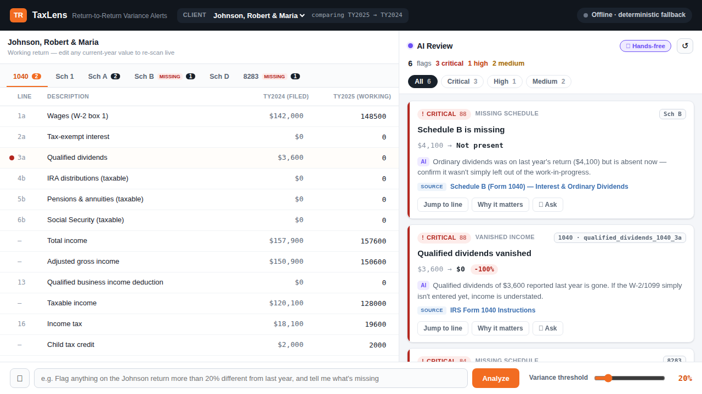

# TaxLens · Automated Return-to-Return Variance Alerts

> A tax preparer fills in this year's return. **TaxLens compares it to last year line-by-line as they work**, and **speaks up** the moment a number is materially off or a form is missing — ranked by importance, each with a plain-English "why" and a clickable IRS citation. The differentiator is **hands-free voice**: alerts are spoken aloud, and you can **ask a voice follow-up** ("why? what was it last year? is there a rule?") and hear a cited answer back. Runs on synthetic sample data (5 clients, including a deliberate zero-alert control).

> **Hackathon Use Case 5.** Preparers miss anomalies when comparing the current-year return to prior years, so errors get caught late in review. TaxLens surfaces them *proactively, before review* — catching missing schedules, dropped deductions, sign flips, and unusual variances automatically.



---

## Quick start

**Prerequisites:** [Node.js](https://nodejs.org/) **18+** (20 or 22 recommended) and npm. Nothing else — no database, no API key, no internet required (it ships with synthetic data and runs fully offline on deterministic fallbacks).

### macOS / Linux (or Git Bash / WSL on Windows)

```bash
./run.sh          # checks Node/npm, installs deps, starts both servers
# then open http://localhost:4200
```

`run.sh` prints a clear error if Node or npm is missing or too old, then starts the **backend** (`:3001`) and **frontend** (`:4200`). Press **Ctrl-C** to stop.

### Windows (PowerShell or Command Prompt)

`run.sh` is a Bash script — on Windows run it from **Git Bash** or **WSL**, *or* start the two servers manually in two terminals:

```powershell
# Terminal 1 — backend
cd backend
npm install
npm start            # → http://localhost:3001

# Terminal 2 — frontend
cd frontend
npm install
npm start            # → http://localhost:4200
```

Then open **http://localhost:4200**. (First compile of the frontend takes ~10–20s.)

---

## Optional: turn on the AI

By default the AI features run on built-in **deterministic fallbacks** (regex rule-parsing + tax-aware template explanations) — the top-right pill reads *"Offline · deterministic fallback."* To enable AI-powered explanations + natural-language parsing, set credentials **before** starting.

**Via a LiteLLM gateway (bearer token — no direct Anthropic key):**

| Shell | Commands |
|---|---|
| **bash / Git Bash / WSL** | `export ANTHROPIC_BASE_URL=https://litellm.int.thomsonreuters.com`<br>`export ANTHROPIC_AUTH_TOKEN=<your-virtual-key>`<br>`export ANTHROPIC_MODEL=anthropic/claude-opus-4-7` |
| **PowerShell** | `$env:ANTHROPIC_BASE_URL="https://litellm.int.thomsonreuters.com"`<br>`$env:ANTHROPIC_AUTH_TOKEN="<your-virtual-key>"`<br>`$env:ANTHROPIC_MODEL="anthropic/claude-opus-4-7"` |

…then start the backend in that same terminal. **Or a direct Anthropic key:** set `ANTHROPIC_API_KEY=sk-ant-…` instead. The pill flips to **"AI live."**

Watch the backend logs to confirm calls actually reach the model:
```
[ai] → SENDING  explanations (/api/explain) · model=… · LiteLLM/proxy → …
[ai] ✓ SUCCESS  …                ← model is reachable
[ai] ✗ FAILED   … HTTP 401 …     ← bad token/model → silently uses the deterministic fallback
```
> "AI live" only means credentials are *present*, not *valid* — the logs are the source of truth. If a model name is rejected, set `ANTHROPIC_MODEL` (or `ANTHROPIC_MODEL_EXPLAIN` / `ANTHROPIC_MODEL_PARSE`) to a name your gateway registers. `temperature` is omitted by default (some models reject it); set `ANTHROPIC_TEMPERATURE` to re-enable.

---

## The demo

The app loads five synthetic clients (each is two consecutive tax years; last year is the "answer key"):

1. **Load Johnson** (TY2024 filed vs TY2025 working). Type — or 🎤 speak — into the bottom bar:
   *"Flag anything on the Johnson return more than 20% different from last year, and tell me what's missing."*
2. **Analyze.** With **🔊 Hands-free** on, the app *speaks*: *"6 anomalies on the Johnson return. 3 critical, 1 high. Highest priority: Schedule B is missing."* The panel ranks: missing **Schedule B**, missing **Form 8283**, **qualified dividends vanished**, **charitable cash −90%**, plus downstream effects.
3. **Voice follow-up.** Click **🎤 Ask** on a card → say *"what was it last year?"* or *"is there a rule?"* → it answers aloud and shows the **IRS citation** (clickable).
4. **Control — it doesn't cry wolf.** Switch the client to **Garcia** (a normal year) → **0 alerts**.
5. **Range:** **Nguyen** (business spike + missing Form 8829), **Patel** (a rental line silently drops to $0 while Schedule E stays), **Thompson** (pick the year-pair → wages vanish, pension/Social-Security appear across retirement).
6. **Tune live:** drag the **threshold slider** (20% → 30%) and watch lower-priority flags drop off; edit any current-year value and the alerts update (a popup confirms a flag was added or **resolved**).

---

## How it works

```
┌──────────── Angular (signals) ─────────────┐      ┌──────────── Node + Express + TS ───────────┐
│ ReturnGrid (editable, prior vs current)     │ HTTP │ /scan       deterministic two-return walk   │
│ AlertsPanel · AlertCard · DeltaChip · Badge │◄────►│ /returns    normalized pair + line registry │
│ NlConfigBar (NL + voice) · Threshold slider │      │ /parse-rule NL → rule   (AI + regex)         │
│ Voice: hands-free TTS + per-card "Ask" (STT)│      │ /explain    "why it matters" (AI + tmpl)     │
│ VarianceStore (single source of truth)      │      │ /ask        voice follow-up  (AI + tmpl)     │
└─────────────────────────────────────────────┘      │ /health     reports ai_available            │
                                                      └──────────────────────────────────────────────┘
```

**The detection engine is the core, and it's pure & deterministic** — no LLM in the comparison path:

- **13 detectors** — sign flip, missing/new schedule, missing line, vanished income, dropped deduction, dropped carryover/depreciation, %-variance, absolute-$ jump, ratio/consistency, structural change, and a sub-threshold *informational* tier. (The principle: let the code do the math, the LLM do the words.)
- **Materiality scoring** — a 0–100 severity blending %-change, log-squashed $-magnitude, and a per-type risk weight, with floors so sign-flips and vanished income never get buried. Sorted into CRITICAL / HIGH / MEDIUM / LOW / INFO; the **Garcia** control yields 0.
- **Traceability** — every flag jumps to its source line and carries a clickable IRS form/Pub citation. *An unexplained flag is worse than no flag.*

The **AI** is layered on top for plain-English explanations, natural-language rule parsing, and spoken follow-up answers — and degrades to deterministic, tax-aware fallbacks when no credentials are set. It's **human-in-the-loop**: the tool flags and explains; it never files or changes anything.

---

## Tax terms (for engineers)

You don't need tax knowledge to read this. Think of it as a **diff + linter for tax returns**: last year is the baseline, this year is the change, and we flag the regressions.

- **Tax return** — one big structured document (modeled here as JSON) reporting a person's income & tax for a year.
- **Form 1040** — the main individual return; everything sums up to a **refund** or **amount owed**. Lines are numbered fields (e.g. `1a` = wages).
- **Schedules / Forms** — attachments for specific situations that feed into the 1040: **A** (itemized deductions), **B** (interest & dividends), **C** (business), **D** (capital gains), **E** (rentals), **SE** (self-employment tax), **8283** (noncash charity), **8829** (home office).
- **The client** — the taxpayer the return is for (Johnson, Nguyen, …). The app's user is the **preparer**.
- **A missing form** (filed last year, gone this year) or a **dropped deduction** is often a silent omission — exactly what TaxLens catches.

---

## Tech & tests

- **Frontend:** Angular 19 (standalone components, signals); zero-dependency Web Speech for voice.
- **Backend:** Node + Express + TypeScript; `@anthropic-ai/sdk` (direct key **or** a LiteLLM gateway via `ANTHROPIC_BASE_URL` + `ANTHROPIC_AUTH_TOKEN`).
- **Tests:** `cd backend && npm test` → Vitest cases assert the clients — **Garcia raises zero alerts**, Johnson's missing forms + charity collapse fire, Nguyen's spike + missing Form 8829, Patel's within-form rental drop, Thompson's new retirement income + the multi-year selector, plus threshold/NL wiring.

```
solution/
├── run.sh                      # preflight (node/npm) + starts both servers
├── shared/types.ts             # the API contract, shared by both ends
├── backend/                    # Node + Express + TypeScript
│   └── src/
│       ├── registry.ts         # line_items → form/label/role + tax constants
│       ├── data/
│       │   ├── returns/*.json   # the 5 synthetic clients (11 files)
│       │   └── adapter.ts       # sample-data schema → internal model
│       ├── engine/             # detect.ts (the diff) + rank.ts (score/consolidate)
│       ├── ai.ts               # AI client wrapper (direct or LiteLLM) + call logging
│       ├── nlparse.ts          # natural-language → rule (AI + regex fallback)
│       └── explain.ts          # "why it matters" + citations + /ask follow-up
└── frontend/src/app/           # AppShell + components + VarianceStore + ApiService
```

> Data is **synthetic** — no real taxpayer PII. The detector heuristics, tax constants, and IRS citations are real; the people aren't.
